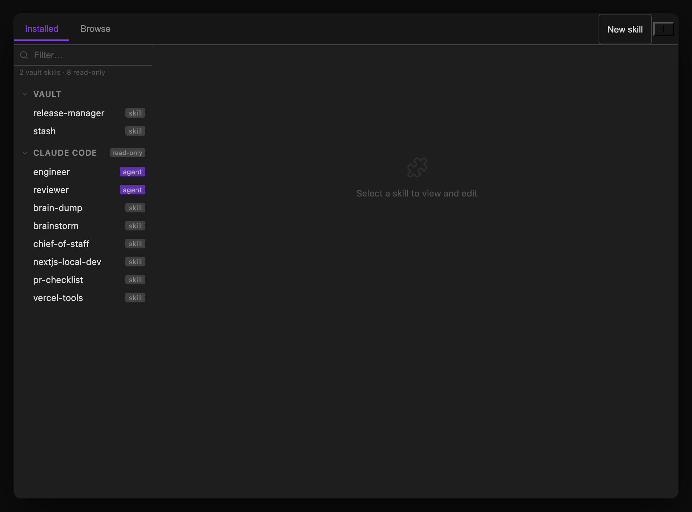

Open the **Skills Manager** panel from the ribbon (puzzle icon) or command palette to browse, install, and edit Claude Code skills. The list and detail panels are split by a **draggable divider** — drag it to resize, double-click to reset to the default width; your chosen width is remembered next time you open the panel.

## Installed tab

Shows everything installed as a collapsible source tree.

The top-right corner of the tab bar has two icon buttons (Installed tab only):

- **Import (+)** — opens a menu with **Folder…** and **File (.skill)…**, letting you install a skill directly from a local folder or a packaged `.skill`/`.zip` archive without going through GitHub.
- **Check for updates (↻)** — shown once you have at least one GitHub plugin source; re-fetches staleness for all GitHub plugin sources in parallel. Its icon spins while running, and a toast reports the result when it finishes, including which sources failed to check (e.g. if you're offline). An indicator dot appears on the button afterward if any plugin has updates. Hover either button for its full status/tooltip.

**GitHub plugin sources** appear as top-level nodes with a badge (`•N`) when updates are available; clicking one expands it to reveal its skills and opens a detail panel with:

- **Update** — git pull, highlighted when updates are available
- **Reload** — re-scan from disk
- **Reinstall** — delete and re-clone for broken installs
- **Remove Source**

Two more nodes sit at the bottom:

- **Vault** — the skills this plugin installed into your vault. Click one to view and edit it, with **Save**, **Reload**, **Reveal in Finder**, and **Uninstall**.
- **Claude Code** — everything in `~/.claude/` (skills *and* agent profiles), marked `read-only`. The plugin shows them because the Claude CLI genuinely loads them into every session, but it never writes to that directory, so those panes offer only **Reload** and **Reveal in Finder**. Edit or remove them with the `claude` CLI, or by hand.

> **Where installs go.** Everything the Skills Manager installs or imports lands in `<vault>/.obsidian/plugins/claude-threads/skills/`, beside the plugin's `skill-sources/` clones — never in `~/.claude/`. That folder shares the plugin folder's fate: community-plugin *updates* leave unknown subdirectories alone, but manually uninstalling and reinstalling the plugin will delete your installed skills along with it.

## Authoring local skills

Choose **New skill**, enter a lowercase identifier such as `meeting-notes`, and edit the starter `SKILL.md`. Authored packages appear under **Local skills** and live in `<vault>/Skills/<identifier>/`. **Settings → Skills → Local skills folder** selects another vault-relative folder; changing it does not move files. Installs, imports, and GitHub clones retain their current paths. There is no migration.

Agents can create complete packages with `skills_create_local({ skillId, skillMd, files? })` and patch them with `skills_update_local({ skillId, files?, deleteFiles? })`. File entries contain a package-relative `path`, `encoding` (`utf8` or `base64`), and `content`. Updates preserve omitted files and remove only explicitly listed paths. `SKILL.md` requires a frontmatter `name` matching the identifier and a nonempty `description`; it cannot be deleted. Supporting files are managed through these tools or the filesystem.

Authored skills are available as `/local:<identifier>` in newly started Claude and Codex sessions. Active sessions are not restarted. Use qualified identifiers returned by `skills_list_installed`, such as `local:meeting-notes`, for inspection or removal when names overlap. `skills_update` continues to pull GitHub sources.

## Browse tab

Search the [skills.sh](https://skills.sh) registry. Results show the skill name, GitHub source, and install count. Click a result to see details and an **Install** button that clones the skill from GitHub into `<vault>/.obsidian/plugins/claude-threads/skills/`. Installed skills are invoked as `/vault:<name>`.

## Skill Sources settings

**Settings → Skills** registers local skill collections to browse and install from within the Skills Manager, independent of the Browse tab's registry search. Each source is either:

- **GitHub** — a repo URL that's cloned into the vault's plugin folder, with an optional display name override. Staleness (`behindCount`) is tracked per source and drives the update badges described above.
- **Local** — a path to an existing skills folder on disk, with an optional separate git repo path if the skills folder lives inside a larger repo (so Update pulls the right repo).

Add or remove sources from Settings → Skills, or via the **Add Source** button, which opens the same add-source flow reachable from the Skills Manager itself.

Once a skill is installed, it's automatically available in the [`/` slash command dropdown](/docs/core-workflow/messaging-and-commands/#slash-commands) in every thread — there's no separate step to wire a newly installed skill into the chat input. Vault-installed skills appear as `/vault:<name>`; skills from your read-only `~/.claude/skills/` library are invoked bare as `/<name>`.
