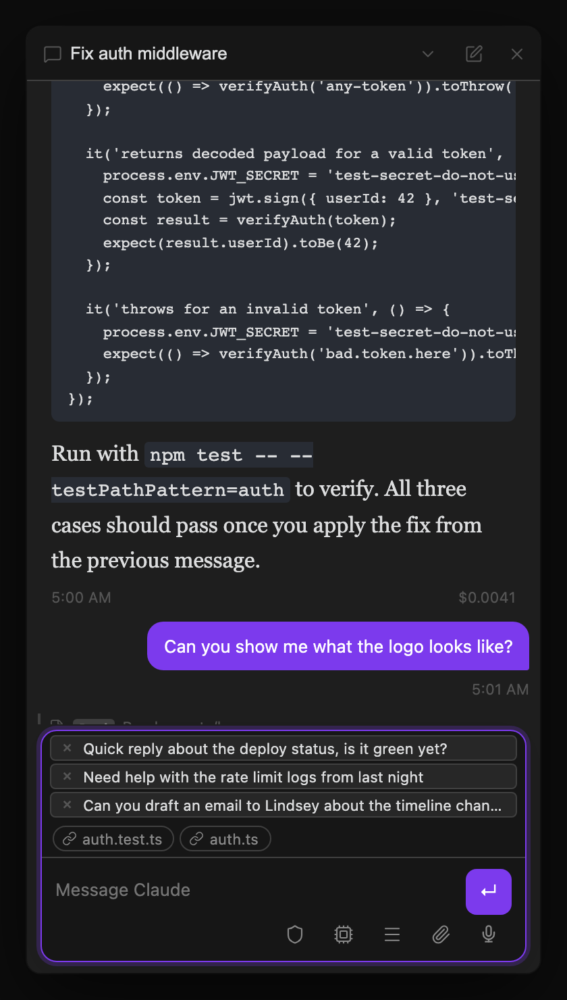
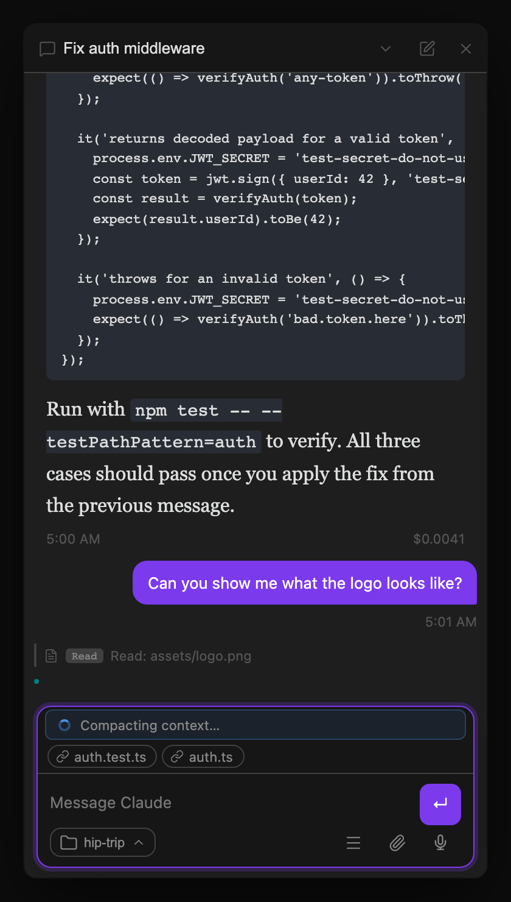
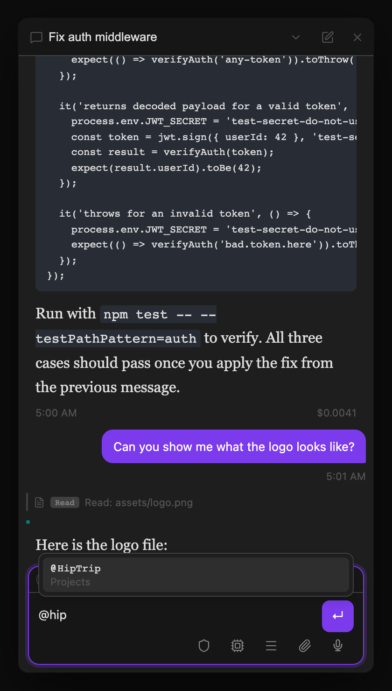
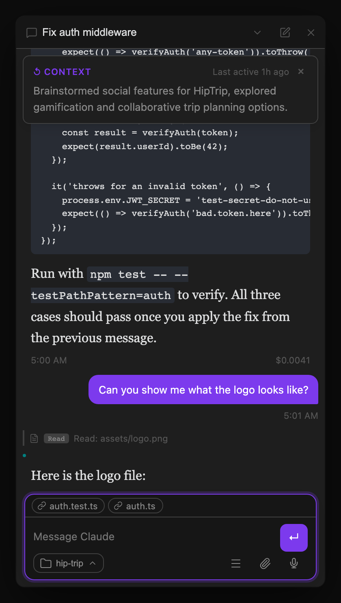

## Sending messages

- **Enter** — send message
- **Shift+Enter** — newline
- **`/`** — opens slash command autocomplete
- **Escape** — cancel the running session; the sent message is restored to the input box so you can edit and re-send

**Collapsible input panels.** All three message-input panels (Chat, Agent Dashboard sidebar, and Kanban dispatch) collapse to a minimal bar at rest — just the textarea and send button. Hover over the panel or click into the textarea to expand secondary controls (attach, mic, model picker, more menu, working-directory chip) with a smooth animation. The panel border softens when collapsed so it reads as a quiet background element rather than competing for attention.

## Message queue

If you send a message while Claude is already processing, it goes into a queue — displayed as stacked, removable rows above the composer. Each row shows a preview of the queued message and an `×` button to discard it. Click any row to pull it back into the input box for editing (an inline confirm prompt prevents you from accidentally discarding your current draft). The queue drains automatically as Claude finishes each turn. Queued messages survive thread switches and plugin reloads.



## Activity indicator

While Claude is processing, a typed status card appears above the input area showing what's happening:

- **Active work** — a pulsing spinner with a short label (e.g. "Compacting context…" during automatic compaction, "Retrying API call…" on transient errors). The card disappears as soon as the operation completes.
- **Rate limit** — if the API returns a rate limit response *before* rejecting the turn outright, a card shows in warning or error style depending on whether the request was allowed to proceed anyway.
- **Model escalation tip** — when a turn is routed to the escalation model, a brief tooltip pops up from the model button rather than reshuffling the layout. See [Model escalation](/docs/core-workflow/models-goals-loops/#model-escalation) for the full behavior.



## Errors and auto-retry

Two failure modes are recovered automatically, shown as a transient amber "reconnecting" notice in the conversation rather than a hard error:

- **Transport hiccup** — the underlying `claude` CLI transport is spuriously force-closed mid-tool-call. The plugin auto-fires one follow-up turn so Claude can verify whether the interrupted action actually succeeded before treating it as a failure.
- **Rate-limited turn** — the API rejects a turn outright with a rate-limit or overload error before processing it at all. The plugin silently retries the *exact same* turn after a backoff delay (up to 5 attempts, growing from ~3s to ~90s) — no duplicate message is added to the conversation, since Claude never saw the original prompt.

If a rate-limited turn exhausts all of its retries, or any other error occurs, it surfaces as a normal error card — but instead of a wall of raw stack-trace text, you get a short one-line summary with a **Show technical details** disclosure you can expand for the full trace.

## Slash commands

Type `/` in the input box to see built-in context commands and your installed Claude Code skills. Navigate with arrow keys, Tab, or Enter.

### Built-in commands (handled by the plugin)

| Command | What it does |
|---|---|
| `/model fable\|opus\|sonnet\|haiku` | Set a persistent model for this thread |
| `/model default` | Reset thread model back to the global default |
| `/model` | Show the current model for this thread |
| `/goal <text>` | Set a persistent goal for this thread — injected into every turn until cleared |
| `/goal clear` | Clear the thread's goal (`/goal` alone shows the current goal) |
| `/loop <interval> <prompt>` | Send a prompt now and re-run it on an interval (e.g. `/loop 10m check CI`); replaces any loop already running on this thread |
| `/loop stop` | Stop the thread's loop (`/loop` alone shows it) |
| `/compact` | Summarize conversation history to free up context window |
| `/clear` | Clear conversation history and start a fresh session |
| `/cost` | Show token usage and cost for the current session |
| `/context` | Show a per-category token usage breakdown for the active session (tools, system prompt, skills, MCP tools, conversation, etc.) |
| `/usage` | Show cross-provider token totals, quota windows and resets, and account activity where available |
| `/create-pr` | Ask Claude to push the branch and open a PR (`gh pr create`) — same action as the [git diff bar](/docs/integrations/git-and-vault/#git-diff-bar)'s Create PR button |
| `/create-pr --draft` | Same, but opens a draft PR — same as the git diff bar's Create draft PR button |
| `/design <brief>` | Start a new design thread from Dashboard/Kanban, or create or revise a secure static UI artifact in Chat, and open it in Geode's ArtifactView |
| `/escalate <prompt>` | Route just this turn to the [escalation model](/docs/core-workflow/models-goals-loops/#model-escalation) (default keyword `/escalate`; keyword and target model are configurable in Settings, and the row only appears here when escalation is enabled) |

### Design artifacts in Geode

Use `/design <brief>` from the Agent Dashboard or Kanban dispatch box to create a new native design-artifact thread, or use it in Chat to create or revise the current thread's artifact. Threads creates a zero-install static UI artifact under `.geode/artifacts/` in your vault, and the agent edits ordinary `index.html`, `styles.css`, `app.js`, and local asset files. The persisted artifact card keeps **Open preview**, **Capture**, and **Reveal source** available after the turn and after reopening the thread.

Inside Chat, `/design` without a brief reopens the existing preview. In Dashboard or Kanban, a brief is required: bare `/design` shows a usage notice, preserves the draft, and creates no thread. New-thread design dispatch does not accept image or text attachments; remove them and send again. Other dispatch commands can still use attachments normally.

Geode's ArtifactView provides live reload, desktop/tablet/mobile viewport controls, runtime diagnostics, and PNG capture. The preview runs in an isolated, ephemeral, Node-less guest with network, clipboard, downloads, popups, and external navigation denied. Outside Geode, Threads reveals the source instead of launching it without that sandbox.

Dashboard and Kanban dispatch behavior for `/model`, `/goal`, `/loop`, `/design`, and `/escalate` is summarized on [Models, Goals, and Loops](/docs/core-workflow/models-goals-loops/#dispatching-with-commands).

### Context, cost, and usage

These commands answer three different questions:

- **`/context`** shows what currently occupies the active model context window, broken down into categories such as the system prompt, tools, skills, MCP tools, and conversation.
- **`/cost`** remains the existing harness-native session command for token usage and cost.
- **`/usage`** opens Claude Threads' cross-provider usage view. It shows thread or session token totals, last-turn tokens when the provider reports them, Claude cost explicitly labelled as estimated, and each available quota window with percentage used and reset time. With supported Codex-service authentication, it also shows cumulative account metrics and recent daily token activity.

Provider capabilities are not identical. Claude account activity is not available through the SDK, and Claude quota data appears only after the SDK emits a rate-limit event during the session. Codex can read current multi-window limits and Codex account daily/cumulative activity, but API-key-only or Bedrock authentication may not expose account activity. The view reports unavailable fields directly rather than estimating or manufacturing parity between providers.

**Command pills** — when you complete a built-in command (type `/goal ` or pick one from the dropdown), it turns into a pill chip at the left of the input box. Type the arguments after it; a single Backspace at the start of the input (or clicking the pill's `×`) deletes the whole command. After a command, argument autocomplete kicks in — `/model ` offers `fable|opus|sonnet|haiku|default`.

**Skills** — every skill available to the session appears below the built-in commands in the same `/` dropdown: your `~/.claude/skills/` library (invoked bare, e.g. `/my-skill`), skills the plugin installed into the vault (namespaced under the `vault` plugin, e.g. `/vault:my-skill`), and skills from any configured plugin source (namespaced after themselves, e.g. `/my-skill:my-skill`). The autocomplete shows the name you actually invoke, so what you pick is what resolves. Selecting one inserts the skill name into your message, which Claude handles via your `CLAUDE.md` configuration. This is the same slash-command surface the [Skills Manager](/docs/automation/skills-manager/) installs into — anything you add there shows up here automatically, with no separate registration step.

## @ file mentions

Type `@` anywhere in the input box to search vault files by name. A dropdown appears showing up to 20 matching files — navigate with arrow keys and press Tab or Enter to insert.



Selecting a file inserts `@[[filename]]` into your message. When you send the message, the plugin resolves each mention and appends the file's full content as context for Claude — useful for asking Claude to work with a specific note, doc, or config file without copying and pasting.

Type `@this` (no search needed) to instantly reference the currently active file in Obsidian. It resolves to the same `@[[filename]]` injection at send time.

## Context compaction

When the context window fills up, Claude compacts the conversation automatically. You can also trigger it manually with `/compact`. Either way, a divider appears in the conversation showing when compaction happened and how many tokens were in context beforehand. Compaction markers are persisted and survive plugin reloads.

## Tool call visibility

As Claude works, you see exactly what it's doing: each tool call renders as a pill showing which file it's reading or writing, with elapsed time once complete. REPL calls get a dedicated icon and summary, git operations render as structured pills, and a file Claude edited that you subsequently modified shows a **"Modified by user"** badge.

**Live grouping.** Consecutive calls of the same kind — a run of file reads, a string of edits — collapse into a single expandable group (e.g. "Exploring (12)") instead of a long scroll of individual pills. This happens **live as the turn runs**, not just after it settles, so a long agentic run never grows an unbounded wall of pills while Claude is still working:

- The in-progress group shows a **"still running" pulse** while a call in it is active.
- A group you **expand mid-turn stays expanded** as more same-kind calls arrive, so you can keep watching the detail without it collapsing under you.
- A group containing a **failed call auto-expands and stays flagged**, so errors are never hidden inside a collapsed pill.

Grouping works on both desktop and [mobile](/docs/integrations/remote-and-voice/#what-you-can-do-on-mobile).

## Inline visualizations

Codex's bundled `visualize` skill answers a "show me the numbers" question by writing a small HTML chart to disk and marking where it belongs in its reply with a content reference on its own line:

```text
visualize{"path":"/abs/path/to/quarterly-revenue.html","title":"Quarterly revenue"}
```

That marker is not a tool call, so nothing in the harness layer sees it. Claude Threads recognises it while rendering the message and replaces it with the visualization itself — live and interactive, in the exact spot the model intended, instead of a line of raw text.

The file on disk is an HTML *fragment*, not a page: no doctype, no `<html>`, no `<body>`. The plugin wraps it into a complete document before showing it, and that wrapper does three things worth knowing about:

- **It matches your theme.** The design tokens the skill's charts are built against (`--background`, `--foreground`, `--primary`, `--viz-series-1`…`6`, and the rest) are mapped onto your theme's own colours and passed in as resolved values, so a chart looks native in both light and dark — and follows the *app's* theme, not your operating system's.
- **It is sandboxed.** The visualization runs with scripts only: no same-origin access, so it can never reach your vault, your notes, or the plugin's credentials; no pop-ups, no modals, no forms. Its network access is limited to the CDN allowlist the skill documents (jsDelivr, unpkg, esm.sh, cdnjs, Google/Bunny fonts) — everything else is blocked. If a visualization tries to push a follow-up prompt into your composer, the plugin shows a notice and drops it rather than typing model-authored text into your input box.
- **It sizes itself.** The card grows and shrinks to fit its contents as charts finish drawing. Very tall visualizations are capped at a readable height with a soft fade at the cut, rather than nesting a second scrollbar inside the conversation.

Each card has a **pop-out** button in its header that opens the same visualization full size in the Web Viewer. Hover the card's title to see the resolved file path it came from.

Visualizations only mount while they are on or near screen, so a long thread full of charts stays responsive and does not re-fetch every chart library each time you switch threads. While a reply is still streaming, a complete marker shows as a quiet placeholder card and only becomes live once the message settles.

**Editing in place.** The skill re-emits the marker every turn while it iterates on the same file. Because the card reads the file at render time, an older message scrolled back to will show the *current* contents of that file, not the version from when the message was written. Codex behaves the same way.

**Mobile.** Visualizations are desktop-only. On [mobile](/docs/integrations/remote-and-voice/#what-you-can-do-on-mobile) the marker renders as a card naming the visualization, with an **Open visualization** button when the file happens to live in your synced vault — the fragment normally sits on your desktop machine's disk, which a phone cannot reach.

Turn the whole feature off under **Settings → Tools → Inline visualizations**; markers then stay as plain text.

## Compressed conversation view

Long agentic threads — especially ones with many tool calls spread across dozens of turns — can be hard to scan. Toggle **Compress view** from the `⋯` menu (top-right of the conversation panel) to collapse the history into a scannable list of one-line summaries.

**How it works:**

- Each entry represents one *exchange*: a user message followed by all the consecutive assistant turns that came back before the next user message (i.e., a full agentic run).
- The summary for each entry is generated by running the combined content of all assistant turns through a lightweight background process — so you get one meaningful summary ("Investigated codebase, added 4 MCP tools, wrote tests") rather than N fragments.
- Summaries are generated lazily in a serial queue (one at a time) so toggling compress view on a 50-message thread won't spawn 50 simultaneous Claude processes.
- Click the **⌄** arrow on any entry to expand it and read the full response with all tool calls intact.
- Toggle the menu item again (now labelled **Expand view**) to return to the normal conversation view.

Summaries are cached in memory for the session. They regenerate on the next reload — which keeps storage simple while keeping the background work cheap (the in-process model is fast and inexpensive).

## Thread summaries

A summary bar above the messages shows what the thread is about. It updates automatically after each response if **Auto-summarize** is enabled, or you can trigger it manually with the brain icon. The summarizer updates the tab name — auto-summarize only does this when the name is still the default "Thread N"; manual summarize always applies the new title regardless of what the tab is currently named. (Tabs also rename themselves automatically after the first exchange — see [Dispatching your first task](/docs/getting-started/first-thread/).)

When you switch back to a thread you haven't viewed in over a minute, a **context recap banner** floats at the top of the conversation showing the thread summary and how long ago you were last active. It auto-dismisses after 10 seconds or when you send a message.


