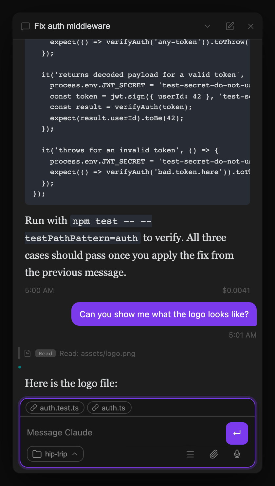

## Model switching

`/model` sets the model for all subsequent turns in a thread:

```
/model fable    → uses Claude Fable 5 for every turn in this thread
/model opus     → uses Claude Opus for every turn in this thread
/model sonnet   → switches to Sonnet
/model haiku    → switches to Haiku
/model default  → resets to the plugin's Default model setting (or the CLI default)
```

A **Default model** dropdown in Settings → Agent picks the model for threads that have no `/model` override. Family aliases (Fable / Opus / Sonnet / Haiku "latest") are always listed first; pinned model IDs are sourced from the SDK's `capabilities_discovered` event, which fires the first time a thread starts in the current Obsidian session. Before any thread has run, the dropdown falls back to a hardcoded list of current models — start a thread and reopen Settings to see the full CLI-sourced list, so no plugin update is needed when Anthropic adds a new model.

You can also switch models without typing: a **model switcher button** (CPU icon) sits in the conversation footer, left of the menu button. Hover it to see the active model; click it to pick Default / Opus / Sonnet / Haiku / Fable from a dropdown. The icon turns accent-colored whenever a per-thread override is active, and it stays in sync with the `/model` command.

The active model is shown as a badge in the thread info bar.

If Claude refuses a response and retries on a configured fallback model, Agent Threads shows a notice identifying the fallback model. If no fallback is available, it shows a clear refusal notice instead.

## Model escalation

`/escalate` (the keyword is configurable) is a one-turn override — it routes just that message to the Escalation model chosen in Settings → Agent (Fable 5, Opus, Sonnet, or Haiku), then the thread model resumes for the next turn. Both the keyword and the target model are configurable in [Settings Reference → Agent](/docs/reference/settings/#agent), and (when escalation is enabled) the current keyword shows up alongside `/model`, `/goal`, etc. in the `/` autocomplete popup so it's discoverable without reading the docs — renaming the keyword or toggling escalation off in Settings updates the popup immediately.

While an escalated turn is running, the model switcher button glows in the accent color and its tooltip names the escalated model, so you always have visible confirmation that the escalation took effect. A brief tooltip also pops up from the model button when the turn starts, fading in, holding for a moment, then fading out automatically — no interaction needed and zero layout shift. The glow clears automatically when the turn finishes.



## Goals

`/goal <text>` pins a persistent goal on a thread. If you already sent the request without `/goal`, right-click your latest sent, non-empty message in the main conversation and choose **Set as goal**. Older messages and messages without text do not offer this action.

Setting a goal does two things:

1. Once the goal is saved, the agent receives a kickoff and starts working toward it — no separate prompt needed. If the thread is busy, the kickoff waits for the active turn and any permission, tool, or background-work callbacks to settle safely.
2. The goal is injected into the authoritative session context on **every subsequent turn**, so it survives context compaction, topic drift, and multi-day threads. The agent is instructed to keep working toward it until it's met or blocked on your input.

Setting or replacing a goal safely refreshes the active Claude or Codex session after persistence. The refresh preserves the session's conversation continuity while ensuring the next turn uses only the latest goal; rapid replacements do not accumulate stale goal instructions.

`/goal` alone shows the current goal; `/goal clear` (or `off`/`done`) removes it. Clearing also performs the same safe session refresh, without sending a kickoff, so the removed goal cannot linger in later turns.

## Loops

`/loop <interval> <prompt>` re-sends a prompt to the thread on a schedule:

```
/loop 30s poll the deploy status     → every 30 seconds
/loop 5m check the build             → every 5 minutes
/loop 1h summarize new emails        → every hour
/loop 10 check CI                    → bare numbers mean minutes
```

Like `/goal`, starting a loop sends the prompt immediately — you don't wait for the first interval to elapse. Intervals below 30 seconds are clamped to 30s. Loops run on the plugin's built-in scheduler, so they **persist across plugin reloads and Obsidian restarts**. If a loop tick arrives before the thread's previous turn has finished, it's retried shortly after rather than piling up as a queued duplicate. A thread can only have one active loop at a time — starting a new `/loop` replaces whichever loop was already running there.

`/loop` alone lists the thread's loop with its next run time; `/loop stop` (or `off`/`cancel`/`clear`) stops it. While a loop is active, a compact scheduled-activity pill appears in the composer footer instead of a permanent banner. The pill shows the interval for a single loop (for example, `Every 5m`); if the thread also has a pending one-time wakeup, it summarizes whichever item runs next and adds `+1`.

Click the pill to open an anchored popover above the composer. Each recurring loop and one-time wakeup has its own row with timing and prompt/reason details. **Stop** removes only the selected loop, while **Cancel** removes only the selected wakeup. The pill disappears when no scheduled activity remains. See [Status Line (Context Footer)](/docs/reference/status-line/#scheduled-activity) for the complete interaction.

For recurring tasks that should run independently of any single thread's lifecycle — surviving even if you close that thread — see [Scheduled tasks](/docs/automation/scheduled-tasks/) instead.

## Dispatching with commands

`/model`, `/goal`, `/loop`, and `/design` also work as prefixes in the Agents List and Agent Board dispatch boxes, applying to the newly created thread:

- `/model opus fix the login bug` — creates the new thread with Opus set as its model and dispatches just the prompt
- `/goal ship the v1 login flow` — creates the thread with that persistent goal and immediately starts working toward it (same kickoff as `/goal` inside a thread)
- `/loop 10m check CI status` — creates the thread, sends the prompt now, and re-runs it every 10 minutes (stop it later with `/loop stop` inside the thread)
- `/design a responsive settings page` — creates a native design-artifact thread, opens it in Chat, and launches Geode's ArtifactView preview

A command with bad or missing arguments shows a notice and keeps your draft instead of creating a thread. The thread-management variants (`/goal clear`, `/loop stop`) only work inside an existing thread.

Design dispatch requires a brief. Bare `/design` creates no thread, and design dispatch does not accept image or text attachments; the draft is preserved so you can remove them and retry. Inside Chat, `/design` without a brief instead reopens that thread's existing artifact. See [Design artifacts in Geode](/docs/core-workflow/messaging-and-commands/#design-artifacts-in-geode).

`/escalate <prompt>` (when escalation is enabled) also appears in the dispatch box autocomplete — it creates the new thread and routes its first turn to the escalation model, same as using it mid-thread. A bare `/escalate` with no prompt shows a usage notice instead of dispatching.
