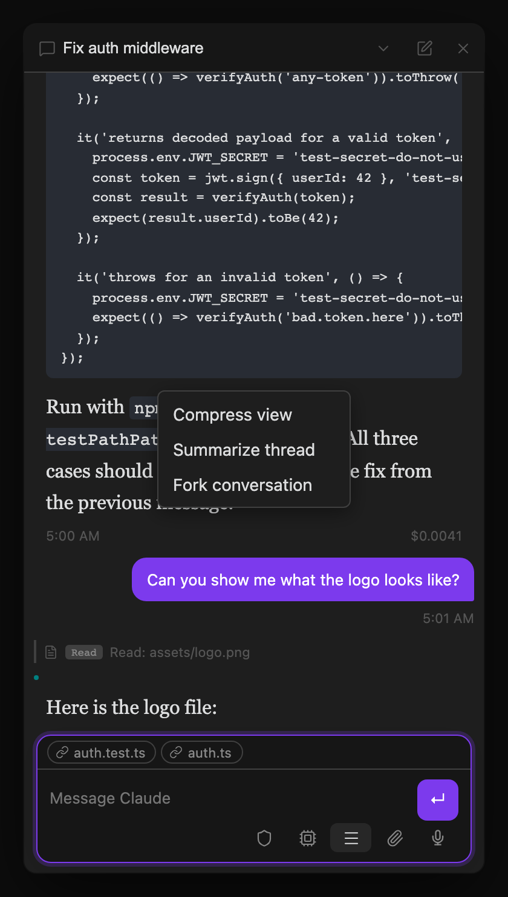

The first time you install Claude Threads on a fresh vault, the plugin opens a three-panel workspace for you automatically: the Chat view in the left sidebar, a bundled "Getting Started" guide in the center editor, and the Agents List in the right sidebar — so the layout makes sense before you write a single message. A welcome notice confirms it's ready. This only happens once; the plugin sets a flag so it won't reappear on later launches, and it's skipped entirely if you already had threads before upgrading (existing users aren't dropped into onboarding).

## Starting your first task

1. Click the **Agents List** ribbon icon, or run **Open Agents List** from the command palette (`Cmd+P`)
2. Type a task into the **dispatch box** at the bottom — for example, `Summarize the README in my project folder`
3. Check the Claude or Codex harness shown on the kickoff button, then press **Enter** (or click the button) — the selected harness spins up a new thread and starts working
4. Watch progress in the Agents List; click any thread row to open the full conversation in Chat

To choose the other harness before sending, open the button's selector; the choice affects new threads in that list, not existing threads or your global default. See [Agents List → Dispatch box](/docs/views/agent-dashboard/#dispatch-box) for mouse, touch, and keyboard gestures.

That's the whole loop. From here, most of what you'll do is send follow-up messages, review results, and dispatch new tasks — see [Sending messages and slash commands](/docs/core-workflow/messaging-and-commands/) for the details of composing and sending.

## Tabs

Each thread in the Chat view gets its own tab, and tabs rename themselves automatically after the first exchange using the thread summarizer — you don't need to name them yourself.

| Action | How |
|---|---|
| New thread | Click `+` in the tab bar |
| Close thread | Hover a tab → click `×` |
| Rename thread | Double-click the tab label |
| Switch to tab N | `Cmd+1` through `Cmd+9` |
| Next / previous tab | `Cmd+]` / `Cmd+[` |

See the full [Commands Reference](/docs/reference/commands/) for every keyboard-accessible action, including the ones without a tab-bar equivalent.

## Forking a thread

Forking splits the current conversation into a new, independent thread. Run **Fork current Claude thread** from the command palette or enter `/fork` in the chat input. A lightweight Claude call distills the existing history into a focused starting prompt for the new thread — so the fork doesn't just copy the whole transcript, it starts the new thread with the relevant context already summarized. The original thread continues completely unaffected.

Forking is useful when a conversation has drifted onto a tangent you want to pursue separately, or when you want to hand off a sub-problem to its own thread without losing the parent thread's momentum.

## Interrupting a thread

Two ways to stop a thread that's actively working:

- Press **Escape** or click **Stop** while it's running — the message you sent is restored to the input box so you can edit and re-send it. This is the fastest way to cancel a run that's about to go somewhere you don't want.
- Run **Interrupt active thread** from the command palette to stop the currently active tab without touching the input box.

Interrupting doesn't discard the conversation history — only the in-flight response is cancelled. You can send a new message immediately afterward.
