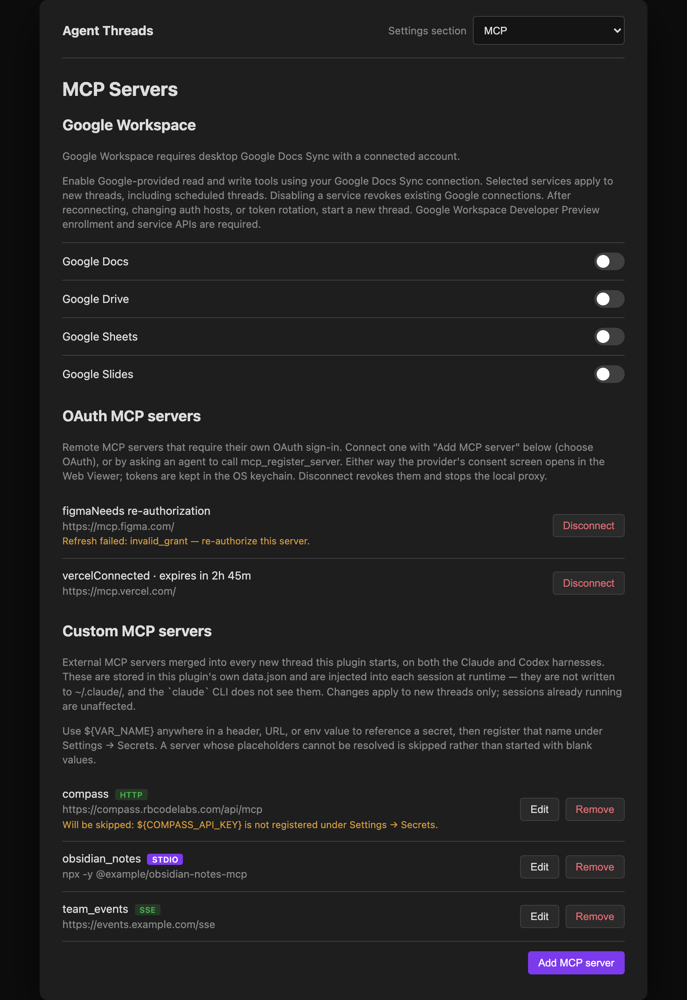
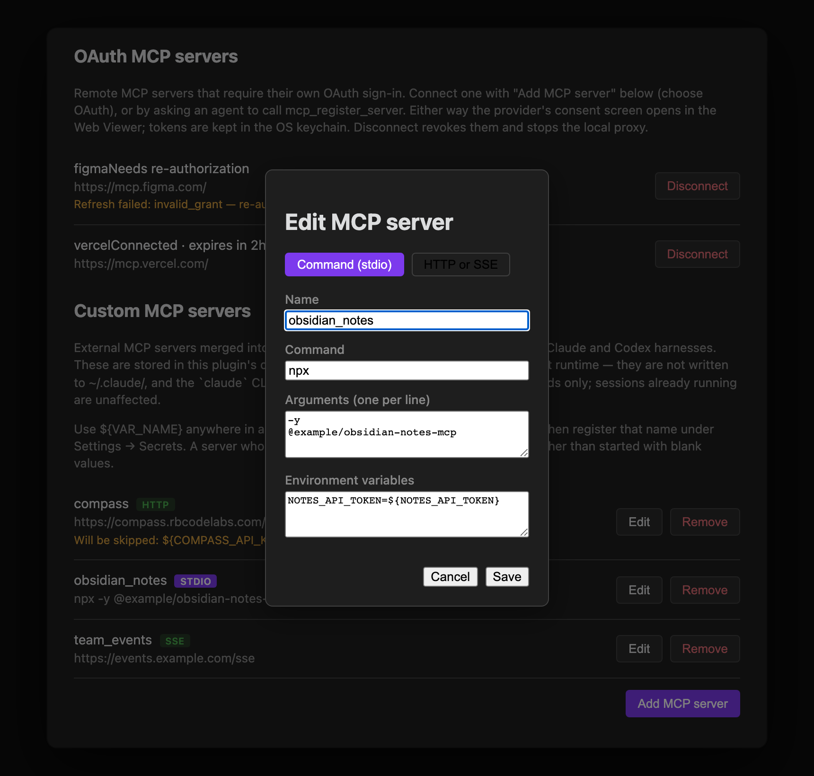

Every Agent Threads session ships with a built-in, host-neutral `claude_threads` MCP server (vault access, thread control, worktrees, and more) that needs no configuration. Codex receives the same canonical tool definitions through its dynamic-tool protocol. The former `obsidian` server and `obsidian_*` tool names remain callable as deprecated compatibility aliases until the next major release, but new prompts, permissions, and automation should use `claude_threads` and the canonical names in the [Agent Tools Reference](/docs/reference/agent-tools/).

Beyond that built-in surface, you can wire in **external MCP servers** — Compass, Helio, a company-internal tools server, or anything else that speaks the [Model Context Protocol](https://modelcontextprotocol.io) — and newly initialized sessions pick them up automatically, on both the Claude and Codex harnesses.

Those external servers are stored in **this plugin's own `data.json`**, not in any Claude Code config file. The **Settings → MCP** tab lets you list, add, edit, and remove them from inside the host app, so the common cases never require hand-editing JSON.


## Opening the tab

Open **Settings → Agent Threads** and select the **MCP** tab. On mobile, the settings screen is reduced to pairing and reload controls — MCP servers are managed from desktop only.

## This is per-vault plugin data, not a Claude Code config file

**The MCP tab edits this plugin's own `data.json`** for the current vault — not `~/.claude/settings.json`, and not any other Claude Code config. That means:

- Servers you add here are **scoped to this vault**; they don't show up in other vaults running Agent Threads, and they aren't shared with the `claude` CLI run outside the plugin.
- The `claude` CLI's own `~/.claude/settings.json` is never read or written by this tab — a server added there doesn't appear here, and vice versa.
- Each configured server is injected into a session's tool set **at runtime**, when a session is initialized, on whichever harness (Claude or Codex) that thread uses.

Changes take effect for **newly initialized sessions**. A registration does not hot-load a server into the session that made the request; an already-running session keeps the MCP servers it started with. New threads receive the new configuration, as does an existing thread if its session is later initialized again through the normal lifecycle.

## Google Workspace

Available in **Agent Threads v0.35.0** as an opt-in beta, with **Google Docs Sync
v0.7.1 or later**. Live four-service validation across both harnesses remains
pending; test with non-sensitive content before using it for important work.

The **Google Workspace** section connects Google's hosted MCP servers using the
Google account already connected in the **Google Docs Sync** plugin in the same
vault. Enable **Google Docs**, **Google Drive**, **Google Sheets**, and
**Google Slides** individually. All four start disabled.

Each enabled service exposes Google's available tools, including read and write
operations, to new Claude and Codex threads. The existing harness permission mode
controls tool approvals. Scheduled threads use the same selected services. You do
not need to enter server URLs, copy access tokens, or maintain Google tool schemas.

### Connect your account

1. Install and enable Google Docs Sync **v0.7.1 or later**, which includes guarded
   connection-refresh support, in the same desktop host and vault. Older releases
   show an update message in the Google Workspace section. Connect the intended
   Google account in that plugin's settings.
2. If your organization hosts its own auth service, use Google Docs Sync's
   **Auth proxy URL** setting. Disconnect the old account before changing hosts,
   then reconnect. Use current versions of the plugin and auth service with
   Geode-aware callbacks and the scopes below.
3. Enable the desired services under **Settings → Agent Threads → MCP →
   Google Workspace**, then start a new thread.

Google credentials are refreshed through the existing connection as requests are
made. If the connection is unavailable, the settings section provides connection
guidance. After switching accounts or auth hosts, start a new thread so an
existing conversation does not silently gain access to a different account. The
thread's account binding is retained across app restarts.
Normal access-token refresh is automatic. If Google rotates the refresh token,
start a new thread. Disabling a service revokes existing Google connections;
re-enabling it requires a new thread.

### Google Cloud prerequisites

Google's Workspace MCP servers are currently in Developer Preview. Confirm both
your Workspace developer-account approval and registration of the specific Google
Cloud project backing the OAuth client. Then enable the ordinary API and MCP API
for each service:

| Service | APIs to enable | OAuth scopes requested by the auth service |
|---|---|---|
| Drive | `drive.googleapis.com`, `drivemcp.googleapis.com` | `drive.readonly`, `drive.file` |
| Docs | `docs.googleapis.com`, `docsmcp.googleapis.com` | Drive scopes plus `documents.readonly`, `documents` |
| Sheets | `sheets.googleapis.com`, `sheetsmcp.googleapis.com` | Drive scopes plus `spreadsheets.readonly`, `spreadsheets` |
| Slides | `slides.googleapis.com`, `slidesmcp.googleapis.com` | Drive scopes plus `presentations.readonly`, `presentations` |

Scope names in the table have the prefix `https://www.googleapis.com/auth/`.
Include the explicit read-only scopes even when requesting their write-capable
counterparts. After the auth service adds scopes, reconnect the account to grant
them; refreshing an old token does not add permissions.

See Google's [setup guide](https://developers.google.com/workspace/guides/configure-mcp-servers)
and [Developer Preview Program](https://developers.google.com/workspace/preview).
Immediately after project registration, preview errors may persist or alternate
with successful calls while Google's checks propagate. Once registration and API
enablement are confirmed, retry over several minutes before changing configuration.
Successful initialization or tool discovery alone does not prove tool execution
is authorized; test a read against a non-sensitive file in each selected service.

## OAuth-gated servers

Available in **Agent Threads v0.36.0** or later. A remote MCP server that requires
its own OAuth 2.1 + PKCE sign-in — Vercel's, for example — registers with
`type: "oauth"` instead of `"http"`. The plugin brokers the entire flow itself:
discovery, Dynamic Client Registration, consent, token custody, refresh, and
revocation. Neither Claude nor Codex needs any OAuth-specific code — both
harnesses see the server as a plain authenticated HTTP endpoint behind a local,
per-server proxy that injects the current access token on every request.

You can connect one two ways, and both run the same flow with the same
validation:

- **Settings → Agent Threads → MCP → Add MCP server → OAuth.** Enter a name
  and the server's URL; everything else is optional.
- **Ask an agent** to call `mcp_register_server` with `type: "oauth"`.

Unlike the stdio/HTTP/SSE transports above, connecting an `oauth` server is
**asynchronous and interactive**, not a one-shot confirm-and-save:

1. You submit the form, or an agent calls `mcp_register_server` with
   `type: "oauth"` and the upstream server's URL.
2. The plugin discovers the authorization server and registers a client (unless
   you supplied a known `clientId`).
3. Your OAuth consent screen opens in the host's Web Viewer. You have up to
   5 minutes to complete sign-in.
4. On success, the plugin exchanges the authorization code for tokens, starts
   the local proxy, and saves the server — newly initialized threads on both
   harnesses can use it from then on.

Denying consent, closing the tab, or letting the window lapse leaves no partial
state behind: nothing is saved, and no proxy keeps running. The same
interactive-host requirement as other registrations applies — a scheduled
thread gets an unavailable result instead of a stalled consent dialog.

Optional fields narrow what the registration does:

| Field | Meaning |
|---|---|
| `scopes` | Space-separated OAuth scopes to request. Omit to use the authorization server's default. |
| `tools.allow` | Expose only these tool names through the proxy. Mutually exclusive with `tools.deny`. |
| `tools.deny` | Hide these tool names from discovery and block calling them (a clean MCP-level error, not a silent failure). Mutually exclusive with `tools.allow`. |
| `clientId` | Skip Dynamic Client Registration with a known public client ID. |
| `clientSecret` | Only for a provider that requires a confidential client, and only as a `${NAME}` placeholder — see [Confidential clients](#confidential-clients) below. |
| `authorizationServerUrl` | Skip protected-resource discovery by pointing directly at the authorization server. |

For example, connecting Vercel's MCP server while blocking its spend-money tools:

```json
{
  "name": "vercel",
  "type": "oauth",
  "url": "https://mcp.vercel.com/",
  "scopes": "openid profile email",
  "tools": { "deny": ["buy_pro", "buy_credits", "buy_addon", "buy_domain"] }
}
```

**Access and refresh tokens live only in the OS keychain** — never in `data.json`,
never returned to the calling thread. The token refreshes proactively ahead of
expiry and, as a fallback, transparently on the next request if the upstream
briefly rejects it. If the authorization server later revokes access or a
refresh attempt fails, the server's status changes to "Needs re-authorization"
and the next thread request to it fails cleanly, the same as any other
unreachable endpoint would.

### Confidential clients

Available in **Agent Threads v0.44.0** or later. Most MCP authorization servers
treat the plugin as a **public client**: PKCE proves possession of the
authorization request, and there is no client secret at all. That is still the
default, and nothing here changes it.

A few providers issue a `client_secret` and then require it on every token
request. There are two places to supply one:

- **Settings → Agent Threads → MCP → Add MCP server → OAuth → Advanced** has a
  masked **Client secret** field. What you type goes straight into the OS
  keychain.
- **An agent** can pass `clientSecret` to `mcp_register_server`, but only as a
  `${NAME}` placeholder naming a secret you already saved — the same convention
  the other transports use for credentials:

  ```json
  {
    "name": "acme",
    "type": "oauth",
    "url": "https://mcp.acme.example/mcp",
    "clientId": "acme-confidential-client",
    "clientSecret": "${ACME_CLIENT_SECRET}"
  }
  ```

  A literal secret is rejected, and so is a placeholder whose secret isn't
  stored — the reply names the missing variable. The reason is not
  house style: a tool call's arguments are recorded in the thread transcript and
  its conversation log, so a literal typed there would be written to your vault
  in plain text. The placeholder keeps the value in the keychain.

Either way the secret is stored in the OS keychain alongside the tokens, never
in `data.json`, which records only that a secret exists. It is sent only when
exchanging or refreshing tokens and when revoking them — never on the
authorization request, which passes through the browser's address bar and
history. **Disconnect** wipes it along with the tokens.

If a server was registered with a secret and that keychain entry later
disappears — a keychain reset, or a vault carried to another machine — the
server comes back as **Needs re-authorization** with an explanation, rather than
appearing connected and then failing at the next refresh.

Providers that issue a secret during Dynamic Client Registration are handled
without any configuration: the plugin asks to be registered as a public client,
but if the authorization server hands back a `client_secret` anyway, that secret
is kept and used.

### Managing a connected OAuth server

**Settings → Agent Threads → MCP → OAuth MCP servers** lists every connected
server with a live status — connected with an expiry countdown, expiring soon,
needs re-authorization, or not configured — and a **Disconnect** button, which
revokes the tokens with the authorization server, clears the keychain, and stops
the proxy.

This section itself has no "Add" button — you connect a server from the
**Add MCP server** button at the bottom of the MCP tab, choosing the **OAuth**
type. The option appears only when adding, never when editing an existing
server: a connected server's tokens live in the keychain, so changing its
configuration means Disconnect followed by a fresh consent round-trip rather
than an in-place edit.



## The external server list

Each configured server is shown as a row with:

- Its **name** (the key under `mcpServers` in the stored config).
- A **type badge** — `stdio`, `http`, or `sse`.
- A **one-line summary** — the command line for `stdio` servers, the URL for `http`/`sse` servers.
- **Edit** and **Remove** actions.
- A **warning line**, if the server references an environment variable or secret that isn't currently resolvable — see [Placeholders and secrets](#placeholders-and-secrets) below.

If no servers are configured yet, the list shows an empty state instead of rows.

## Adding or editing a server

**Add MCP server** (or **Edit** on an existing row) opens a form with a type toggle between the two transports Claude Code can launch from file config:



| Type | Fields |
|---|---|
| **Command (stdio)** | Name, Command, Arguments (one per line), Environment variables (`KEY=VALUE` per line) |
| **HTTP or SSE** | Name, URL, transport (`http` or `sse`), Headers (`KEY=VALUE` per line) |

Names may contain only letters, numbers, hyphens, and underscores, and must be unique. The form validates required fields (a command for stdio, a URL for HTTP/SSE) before saving, and renaming an entry moves it to the new key rather than leaving a duplicate behind.

## Registering a server from a thread

An agent in an interactive desktop thread can call `mcp_register_server` to propose a new external server without opening Settings. For `stdio`, `http`, and `sse`, the tool accepts the same flat configuration shape that the MCP tab stores; `oauth` uses a different field set and a multi-step interactive flow, described in [OAuth-gated servers](#oauth-gated-servers) above.

| Field | Applies to | Description |
|---|---|---|
| `name` | All | Unique server name containing letters, numbers, hyphens, or underscores. Built-in and unsafe object-property names are reserved case-insensitively. |
| `type` | All | `stdio`, `http`, `sse`, or `oauth`. |
| `command` | `stdio` | Executable or command to start. Required for `stdio`. |
| `args` | `stdio` | Optional array of command arguments. |
| `env` | `stdio` | Optional object of environment-variable names and values. |
| `url` | `http`, `sse`, `oauth` | HTTP(S) endpoint. Required for remote transports; embedded URL credentials are rejected. For `oauth`, this is the upstream MCP server's root URL and must be `https://`. |
| `headers` | `http`, `sse` | Optional object of HTTP header names and values. Not used for `oauth` — see `scopes`/`tools` in [OAuth-gated servers](#oauth-gated-servers). |

Registration is **create-only**. If the same name already has an identical configuration, retrying succeeds as an unchanged no-op. If the name belongs to a different configuration, the tool reports a conflict and changes nothing; use **Settings → MCP** when you intentionally need to edit, rename, or remove a server.

The result has `success`, `status`, and `message` fields. `status` is one of `registered`, `unchanged`, `conflict`, `invalid`, `cancelled`, `unavailable`, or `failed`; only `registered` and `unchanged` are successful. Those successful results also include `requiredVariables`, a sorted array of every `${VAR_NAME}` referenced by the configuration. The names are returned unresolved and are not checked for availability until a session initializes. The response never repeats the submitted configuration, a resolved variable, or a credential value.

Before saving a new configuration, the host shows its own confirmation dialog even if the thread's ordinary tool approvals are bypassed. This is a separate safety boundary because a `stdio` server will run its configured command automatically when a later session initializes. The dialog also makes clear that the registration is global to this vault's plugin settings, not limited to the calling Project. Cancelling leaves settings unchanged.

The confirmation dialog is available only from an interactive desktop thread. Scheduled and other noninteractive sessions cannot approve a registration and receive an unavailable result instead; they cannot silently add an MCP server while running under `dontAsk`.

The tool does not launch a command or contact a remote endpoint while registering it. After the host confirms, it saves the unresolved configuration to `data.json`. The successful result means the save completed; it does not mean the external server is reachable.

### Credentials in agent registrations

Never put an API key, token, password, cookie, or other secret directly in a tool call. Put a `${VAR_NAME}` placeholder in the configuration, then call `request_secret` so the user can enter the value into the OS keychain without exposing it in the conversation.

The registration tool rejects a literal value when a command argument, URL query parameter, environment-variable name, or header name looks credential-related (for example, `Authorization`, `API_TOKEN`, `password`, or `cookie`). Placeholder forms such as `${NOTES_API_TOKEN}`, `Bearer ${NOTES_API_TOKEN}`, and `Basic ${NOTES_API_TOKEN}` are accepted. This check is deliberately conservative, but it is a name-based safety check rather than a secret detector: arbitrary literals in fields that do not look credential-related are allowed and **must contain only nonsecret configuration**.

One field is stricter than the heuristic: an `oauth` registration's [`clientSecret`](#confidential-clients) is placeholder-only, whatever the value happens to look like.

For example, an agent can propose this remote server configuration and then request `NOTES_API_TOKEN` separately:

```json
{
  "name": "notes_api",
  "type": "http",
  "url": "https://notes.example.com/mcp",
  "headers": {
    "Authorization": "Bearer ${NOTES_API_TOKEN}"
  }
}
```

### Placeholders and secrets

Environment-variable values and HTTP header values support `${VAR_NAME}` placeholders. These are stored **verbatim** in `data.json` — the tab never resolves or reveals a secret — and are expanded only when a live thread starts, using the same resolution as [Extra environment variables](/docs/reference/settings/#environment): process environment variables merged with keychain-stored secrets. This keeps real tokens out of `data.json` while still letting each thread authenticate.

**If a placeholder can't be resolved — the variable is unset and no matching secret is registered — the server is skipped entirely for that session, rather than starting with a blank credential.** You'll see this in two places:

- A row in the **Settings → MCP** list shows *"Will be skipped: `${VAR_NAME}` is not registered under Settings → Secrets."*
- The first time a thread hits this during a session, a one-time notice banner reports it (deduplicated per warning message, so it won't repeat every turn).

Earlier versions of the plugin expanded an unresolved placeholder to an empty string and injected it anyway — which meant a server could silently authenticate with a blank token and fail in confusing ways. Open **Settings → Agent Threads**, choose **Secrets** in the section selector, and save the missing secret to clear the warning. Nonsecret variables can be added under **Agent → Extra environment variables**.

## Related

- [Permission Modes and Plan Mode → MCP Elicitation](/docs/permissions/permission-modes-and-plan-mode/) — how a thread prompts you for a credential or form an MCP server asks for mid-session.
- [Settings Reference](/docs/reference/settings/) — every settings tab at a glance, including this one.
