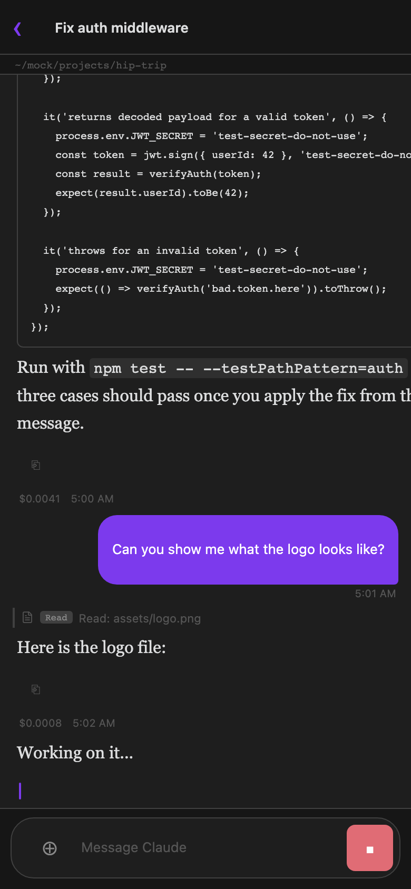

## Remote access (mobile)

Agent Threads can mirror your desktop sessions to Obsidian Mobile in real time. Your phone becomes a thin client: you can read the conversation as it streams, send messages, approve permission requests, answer agent questions, and switch between threads — all over a secure WebSocket relay. The desktop runs the active Claude or Codex harness; mobile just shows the state.

**Prerequisites:**

- Obsidian desktop with Agent Threads installed and running
- Obsidian Mobile with Agent Threads installed via [BRAT](https://github.com/TfTHacker/obsidian42-brat)
- Both devices on any internet connection (no LAN required)

### Setup

1. On desktop: open **Settings → Agent Threads → Remote** and toggle **Enable remote access** on
2. Click **Show pairing QR code** — a QR code appears with a **5-minute expiry window**
3. On mobile: open the Agent Threads ribbon icon, tap **Connect to Desktop**, then scan the QR code (or tap the `claude-threads://pair` link if you're on the same device)
4. The mobile view refreshes to show all your desktop threads

### Manual pairing (URI scheme)

If you can't scan a QR code, send yourself the pairing link directly:

```
claude-threads://pair?roomId=<ROOM_ID>&relay=<RELAY_URL>
```

Opening this URL on any device with Obsidian Mobile + Agent Threads installed will pair it to your desktop.

### What you can do on mobile

- Read streaming conversation output and tool calls in real time
- Send messages, approve or deny permission requests (including **Always Allow**)
- Answer **agent questions** using the same cards as desktop. Claude questions support single-select and multi-select choices plus **Other**; Codex questions support single-select choices, **Other** or free text, and masked secret input
- Switch between threads and search the thread list by title or summary
- See each thread's **status rail** — spinner cards for active tool calls, error cards for failed threads
- Copy any assistant message to clipboard with the ⎘ button
- View the thread's **cwd chip**, **model**, and **message timestamps**
- See **queue rows** for pending messages (tap to pull back into the composer, `×` to cancel)
- View **tool pill icons** matching the desktop view, including [live grouping](/docs/core-workflow/messaging-and-commands/#tool-call-visibility) of consecutive same-kind calls into a single expandable group

### Limitations (the thin client)

- Desktop must be running and connected — mobile cannot start new Claude sessions without desktop
- Mobile is a read-mostly thin client; it cannot access your vault files or run tools directly
- One desktop per room ID; rotate the room ID in Settings to revoke all mobile access



## Push-to-talk voice input

Hold the configured push-to-talk key (default: `Alt+Space` / `Option+Space` on Mac — set it in **Settings → Features → Push-to-talk hotkey**) while focused in any input, and speak. The microphone activates while you hold the key; releasing it stops recording and transcribes your speech using Whisper via your configured OpenAI API key. The transcript populates the input box so you can review and edit before sending. The floating input panel highlights while recording so you always know the mic is live.

This is dictation only — a single push-to-talk turn produces text you send like any other message. It's a distinct feature from a live, bidirectional voice conversation with an AI; push-to-talk simply gets your spoken words into the compose box faster than typing.

Configure the OpenAI API key (stored in your OS keychain) and the hotkey itself under [Settings Reference → Features](/docs/reference/settings/#features).
