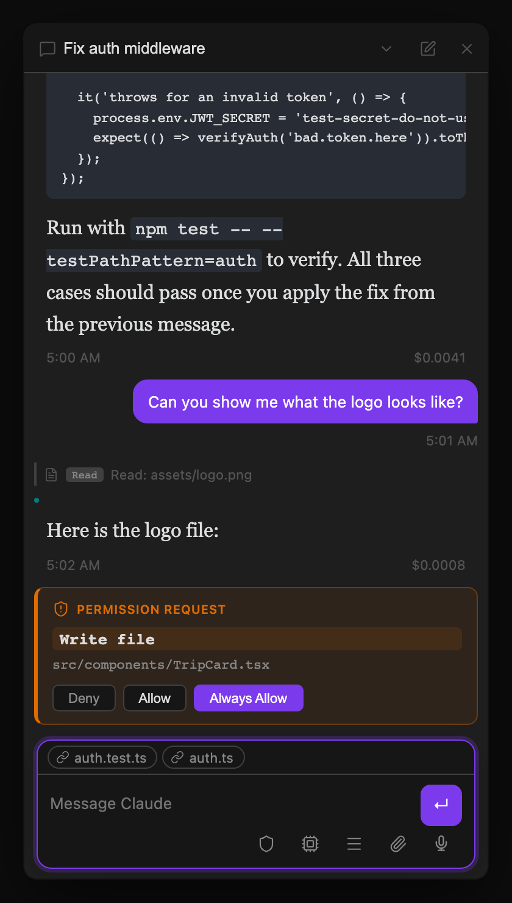

## Permissions

When the active Claude or Codex agent needs to write a file or run a command, a permission card appears inline in the conversation asking you to **Allow**, **Deny**, or **Always Allow**. Always Allow adds the tool to a per-vault allowlist so you're never asked again for that tool. You can also resolve permissions directly from the [Agent Dashboard](/docs/views/agent-dashboard/) without switching threads.

The default behavior can be changed globally in **Settings → Tools → Permission Mode**, or **per-thread** via the shield (🛡) button in the thread footer — a thread-level override takes precedence over the global setting and is useful when you want Plan Mode for one specific task without affecting other threads.

| Mode | Behavior |
|---|---|
| `default` | Use the selected harness's default permission behavior |
| `acceptEdits` | Automatically accept file edits; prompt for commands and other tools |
| `bypassPermissions` | Skip all permission prompts — the agent executes everything without asking |
| `plan` | The selected harness proposes a written plan before taking any action; you approve, edit, or reject it before it proceeds — see [Plan Mode](#plan-mode) below |
| `dontAsk` | Suppress all interactive permission dialogs; the agent proceeds without confirmation. Intended for scheduled/background sessions that run unattended |
| `auto` | The agent autonomously decides when to prompt vs. proceed based on action risk |

> **Note for scheduled sessions.** Threads created by the built-in scheduler automatically use `dontAsk` so [cron jobs](/docs/automation/scheduled-tasks/) never stall waiting for a permission dialog that nobody is watching. They also inherit any external MCP servers defined in `~/.claude/settings.json` (Compass, Helio, or any other user-configured HTTP/SSE/stdio server) alongside the plugin's built-in tools, so scheduled agents have the same tool surface as an interactive CLI session — `${VAR_NAME}` placeholders in that config are resolved from environment variables and keychain-stored secrets.

## Plan Mode

Set **Permission Mode → `plan`** globally in Settings, or use the **shield button** in the thread footer to set it for a single thread. Claude and Codex can then investigate without mutating files or external state until they produce a plan for your approval. Read-only commands and other non-mutating research are still available.

Codex can also call its no-argument `EnterPlanMode` control when a task needs investigation before implementation. The current turn hands off at a safe boundary, then Claude Threads starts one fresh native Codex Plan collaboration turn under a read-only sandbox. Claude provides the equivalent transition through its native plan-mode capability.

**The flow:**

1. You send a message as normal.
2. A **"Planning…"** visual state appears while the active agent gathers context without making changes.
3. When the agent returns its native structured plan, the existing inline approval card replaces the spinner and shows the full proposed plan text.
4. You pick one of three actions on the card:
   - **Approve** — the thread switches back to Default mode before starting one fresh implementation turn.
   - **Edit** — the plan text becomes editable in-place; submitting it switches to Default mode and starts the implementation turn with your revised plan.
   - **Reject** — the thread stays in or returns to Plan mode and makes no edits. Your queued or new feedback is used for the next revision; if there is no feedback, the agent is asked to revise the plan.

Plan Mode is useful for risky or large-scale tasks where you want to review the approach before any files are touched.

## MCP Elicitation

Some MCP servers need a credential or a form filled before they can proceed — for example, an OAuth flow or a confirmation dialog. When this happens, Claude Threads renders an elicitation card inline in the conversation rather than silently failing.

- **URL auth card** — displays a clickable link for the OAuth URL. Click it to open the auth page in Obsidian's Web Viewer (or your system browser), complete the flow, then return to the thread. Claude resumes automatically once the server receives the credential.
- **Form card** — renders input fields derived from the server's JSON schema (text fields, selects, checkboxes). Fill in the form and submit; the response is forwarded to the MCP server and the session continues.

Without elicitation support the session would stall indefinitely with no visible feedback. The card makes the situation visible and actionable without leaving Obsidian.
