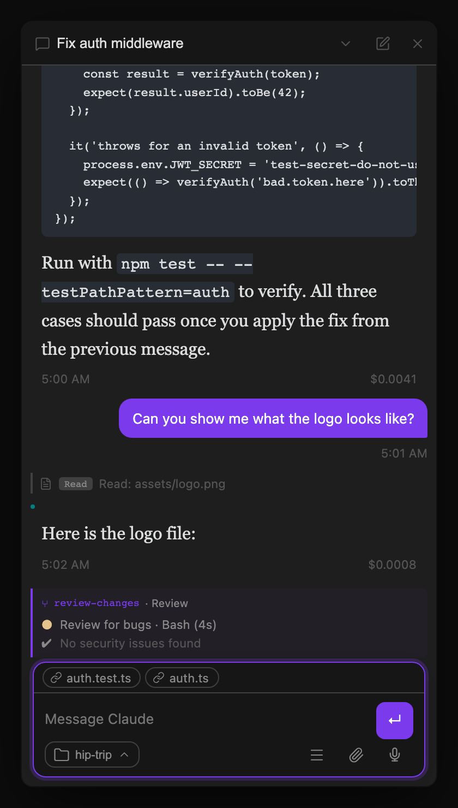

Open the **Agents List** from the ribbon or command palette to see all threads at a glance. Threads are grouped by Project and status. Each adaptive row uses two lines: status, title, and recency on the primary line; live activity, repository/path, and child-agent count on the secondary line. Lower-priority metadata truncates before the row can overflow a narrow sidebar.

The selected thread has an accent-tinted background and a trailing accent bar, making it visible in both light and dark themes without obscuring its status indicator.

## Dispatch box

A floating dispatch box sits at the bottom of the Agents List. Type a task and press Enter to spin up a new thread and start it working immediately — this is the fastest way to launch a task without first opening Chat. The dispatch box also accepts the `/model`, `/goal`, `/loop`, and `/design` prefixes described in [Dispatching with commands](/docs/core-workflow/models-goals-loops/#dispatching-with-commands), and supports attaching images or files via the paperclip button or drag-and-drop.

Use the themed **Project** menu to choose the new thread's Project and initial working directory. The pill shows your current choice, and a checkmark marks it in the menu. **No Project** uses the global default cwd. Your Project choice remains selected while you add or change harness, model, goal, loop, attachment, or image options. See [Projects](/docs/integrations/git-and-vault/#projects) for cwd resolution and the distinction between context focus and access control.

Use `/design <brief>` here to create a new native design-artifact thread, open it in Chat, and launch Geode's ArtifactView preview. Bare `/design` shows a usage notice and creates no thread. Design dispatch does not accept image or text attachments; if any are present, Threads keeps the draft and asks you to remove them. See [Design artifacts in Geode](/docs/core-workflow/messaging-and-commands/#design-artifacts-in-geode) for the artifact workflow and in-Chat revision behavior.

The kickoff button displays the harness that will own the new thread: **Claude** or **Codex**. Press Enter or click the button to dispatch with the harness shown. To change it without dispatching, right-click or press and hold the button; from the keyboard, focus it and use `Shift+F10`, the Context Menu key, or `Alt+Down`. Choosing Claude or Codex updates the button, and that choice stays local to the mounted list while you launch more threads.

**Settings → Agent → Agent harness** provides the initial default only. An Agents List choice does not rewrite that setting, and a thread stays with the harness that created it—you cannot switch an existing thread. The [Kanban dispatch panel](/docs/views/kanban-board/#dispatching-from-the-board) uses the same selector.

You can resolve pending permission requests directly from Agents List rows without switching threads — see [Permissions](/docs/permissions/permission-modes-and-plan-mode/) for what those requests look like.

## Waiting threads

When a thread has a pending `ScheduleWakeup`, the Agents List keeps it in the **Waiting** group and shows a live `Resumes in…` countdown with the wakeup reason. This list classification remains visible across threads even though the conversation itself uses a compact [scheduled-activity pill and popover](/docs/reference/status-line/#scheduled-activity) for inspection and item-specific controls.

## Live activity (running threads)

While a thread is actively processing, the Agents List shows a live one-line summary of the current tool call or step — so you can see "Reading src/components/Header.tsx" or "Running npm test" without switching to that tab.

When a thread runs the `Workflow` tool for multi-agent orchestration, this live activity extends into a full inline progress block in the conversation itself — pinned above the streaming output — showing the workflow's name, current phase, and a row per spawned sub-agent (a pulsing dot while running, filled when done, ✗ on failure). Rows appear as agents launch and update in place as they complete, so you can see the full run at a glance even before the workflow finishes. The block is rendered entirely from the SDK event stream, so it appears immediately and has zero overhead for threads that don't use workflows.

## Native agent teams

When a Claude or Codex thread launches native child agents, the Agents List shows a compact agent-count control beneath the owning thread. The count is green only while at least one child is starting, working, or waiting; once every run is terminal or unavailable, it uses the same faint secondary treatment as recency. Search still includes agent role, task, and current activity, and clicking the count opens the parent conversation’s team picker, where a compact composer pill and popover give you the same tree. See [Native Agent Workspace](/docs/views/native-agent-workspace/) for persistence, reload behavior, and currently supported controls.

## Completed-response previews (idle threads)

For an idle thread, the secondary line previews the latest assistant response. The preview is flattened to one line and truncated to keep the row compact. The separately generated thread summary remains searchable, but it is not displayed in the Agents List row.

After each completed response, the summarizer can run in a lightweight background process (a separate Claude Code instance using a small model) to create a multi-sentence recap and suggested title. Summarization behavior — auto vs. manual, and which model does the summarizing — is configurable in [Settings Reference → Features](/docs/reference/settings/#features).

## Scheduled Jobs

An hourly (or more frequent) [scheduled task](/docs/automation/scheduled-tasks/) can produce dozens of quiet threads a day, burying the manually-created ones you actually need to triage. When a run created by the scheduler is unreviewed, reviewed, or empty — never one that's working, waiting, awaiting a permission/question/plan, or failed — it is collapsed with runs from the same job inside that Project’s **New**, **Reviewed**, or **Ready** group. Each job rollup shows its name, run count, and latest run time. Click it to expand the individual runs.

Enabled by default — disable via **Settings → Features → Kanban board → Stack scheduled job threads**, see [Settings Reference → Features](/docs/reference/settings/#kanban-board).

## Archive from the list (right-click)

Right-click any thread row for a single menu item — **Archive thread** — so you no longer have to open a thread just to close it. Archiving writes the thread to its vault note and removes it from the live list, exactly like the `×` on a thread tab; a run with no messages is dropped without leaving an empty note behind. [Kanban](/docs/views/kanban-board/#archive-from-a-card-right-click) cards carry the same menu.

Right-clicking a **Scheduled Jobs** rollup row archives that whole rollup at once — **Archive these N runs**. Because one job's runs can be split across status groups (New, Reviewed, Ready) and across Projects, a single job can render as several rollups, so a second item — **Archive all M runs of this job** — appears only when the job has runs the rollup you clicked isn't showing. That turns "clear 14 runs of last night's cron job" into one action instead of fourteen.

You are asked to confirm only when there is something to lose, and never more than once per action. There are three triggers:

- Archiving a thread that is still running — archiving stops that session.
- Archiving a Portfolio Orchestrator or a Project Orchestrator — it stops portfolio or Project review until one is recreated, see [Project and Portfolio Orchestrators](/docs/views/thread-orchestrator/).
- Archiving more than one run at a time.

A combination — say, a bulk archive that includes a running orchestrator — still asks exactly once, in a single dialog listing every reason. Archiving a single idle, non-orchestrator thread happens immediately, with no dialog.

Any pending [`ScheduleWakeup`](/docs/reference/agent-tools/#session-tools) on an archived thread is cancelled, so an archived thread can't come back to life afterwards. The last remaining thread cannot be archived.

This is a desktop-only interaction: Obsidian Mobile does not fire a right-click (`contextmenu`) gesture.

## Jump to latest unreviewed

Run **Jump to latest unreviewed completed agent** from the command palette to open the Agents List (if it isn't already open) and jump straight to the most recently completed thread you haven't looked at yet. This is the fastest way to work through a backlog of finished agents after dispatching several tasks in parallel.

Click any thread row to open it in Chat, where you can read the conversation and send the next message.

## Background tasks stay "Working"

A thread that spawns a background subagent (`Agent(..., run_in_background: true)`) or runs the `Workflow` tool can have its own turn finish — and its activity line stop updating — before that spawned work actually completes server-side. Rather than misclassifying the thread as New/Reviewed/Ready the moment the outer turn ends, the Agents List (and the [Kanban board](/docs/views/kanban-board/)) keeps it under **Working** until the background task or workflow reports back, so you don't have to stumble onto a stray notification to realize something is still running.

What happens when it reports back depends on whether the thread is still active:

- **Thread still streaming:** the result appears inline through the running turn's live task pill.
- **Thread has gone idle:** a ✓/✗ summary is appended to the conversation as a subtle centered notice row, so it remains available when you reopen the thread or scroll back instead of disappearing as a transient toast.
