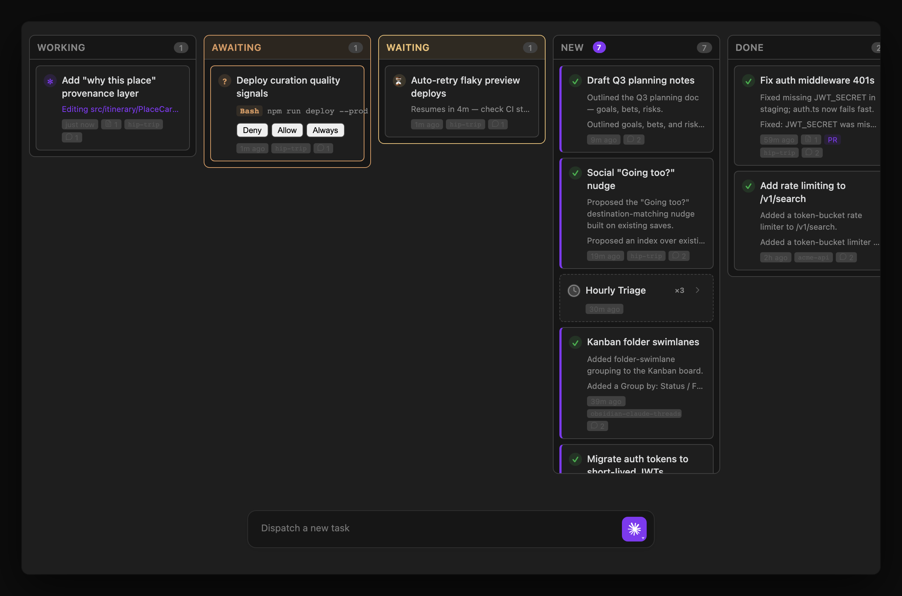
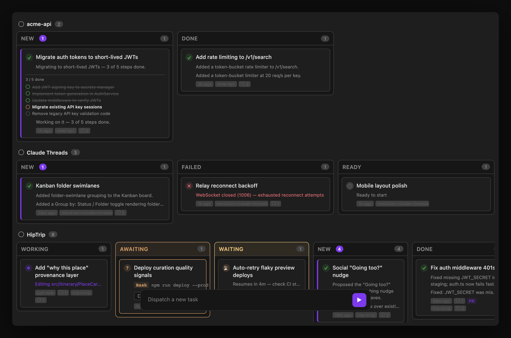

Toggle the **Kanban** button in the Agent Dashboard toolbar (or run **Open Kanban Board** from the command palette) to switch from the default list view to a board layout. Each thread is a card, bucketed into a column for its agent state:

| Column | Meaning |
|---|---|
| **Working** | Actively processing a turn — also covers a thread whose own turn has ended but a background subagent (`Agent(..., run_in_background: true)`) or `Workflow` task it spawned hasn't reported back yet, so it doesn't get miscategorized as New/Done/Ready while still doing work server-side |
| **Awaiting** | Waiting on a permission prompt or agent question |
| **Waiting** | A `ScheduleWakeup` is pending — shows a live countdown, e.g. "Resumes in 4m — check CI status" |
| **New** | Unreviewed — completed since you last looked |
| **Done** | Finished and reviewed |
| **Failed** | Ended in an error state |
| **Ready** | Empty — no active work |

Columns are sorted most-recently-active first. The board has its own floating dispatch panel at the bottom — type a task and press Enter to launch a new thread without leaving the board. List view is the default; the preference persists across reloads.

## Dispatching from the board

The kickoff button displays the selected Claude or Codex harness. Press Enter or click it to dispatch; right-click, press and hold, or use its keyboard menu to change the selection without sending. Selection is local to the mounted Kanban view, and Settings supplies only the initial default. See [Agent Dashboard → Dispatch box](/docs/views/agent-dashboard/#dispatch-box) for all selector gestures and harness behavior.

The panel accepts the same `/model`, `/goal`, `/loop`, and `/design` prefixes as the Dashboard. `/design <brief>` creates a new native design-artifact thread, opens it in Chat, and launches the ArtifactView preview. Bare `/design` shows a usage notice and creates no thread. Image and text attachments are not accepted for design dispatch; Threads preserves the draft so you can remove them and try again. See [Design artifacts in Geode](/docs/core-workflow/messaging-and-commands/#design-artifacts-in-geode) for details.

When a thread owns Claude or Codex child agents, its card also shows a compact native-agent count. Open the thread or [Agent Dashboard](/docs/views/agent-dashboard/) to inspect the nested team; see [Native Agent Workspace](/docs/views/native-agent-workspace/) for details.

## Task list on cards

When a thread has an active Claude `TodoWrite` / `TaskCreate` checklist or Codex `update_plan` checklist, its kanban card shows a compact task list: up to 5 items with status icons (✔ completed, ■ in-progress, ○ pending), a "X / Y done" progress line, and "+N more" when there are additional tasks. The list updates live as the agent ticks items off — useful for seeing exactly how far along a long-running task is without opening the conversation.

## Group by folder or project

The group-by toggle in the board header (the icon next to search) cycles through three layouts: **status columns** (the default), **folder swimlanes**, and **project columns**. Each click advances to the next; the choice persists across reloads.

### Folder swimlanes

One horizontal lane per app/project, so you can see every conversation for a given codebase together. Each lane is keyed by the thread's assigned [Project](/docs/integrations/git-and-vault/#projects), falling back to a working-directory label (git repo name) when no project is set, and an **Unassigned** lane catches threads with no folder. Inside each lane the cards are still grouped into the same status columns (empty columns are hidden to keep lanes compact). Lanes are ordered alphabetically (case-insensitive), with Unassigned pinned last.

### Project columns

One vertical column per app/project (same project resolution as folder swimlanes — alphabetical, Unassigned last), with each column's cards grouped under status **section headers**: Working, Waiting, New, Reviewed, Failed, Ready. This mirrors the Agent Dashboard sidebar's grouping — awaiting-permission threads fold into **Working**, and empty sections are omitted. Each column reads top-to-bottom like a compact per-project dashboard, which keeps a busy single-project board scannable without horizontal scrolling.

## Stacked scheduled-job threads

Repeat runs of the same [scheduled task](/docs/automation/scheduled-tasks/) pile up fast — an hourly triage job produces ~24 cards a day, crowding out the threads you started yourself. In the quiet columns only (**New**, **Done**/**Reviewed**, **Ready** — a run that's Working, Awaiting, Waiting, or Failed always stays its own card), runs that share a scheduled job collapse into a single dashed-border rollup card: job name, a "×N" run count, and the latest run's time. Click the card to expand it into the individual run cards, indented beneath. This applies in status-column, folder-swimlane, and project-column mode.

Enabled by default — disable via **Settings → Features → Kanban board → Stack scheduled job threads** if you'd rather see every run as its own card, see [Settings Reference → Features](/docs/reference/settings/#kanban-board).

## Auto-collapse side panels

Set **Settings → Features → Kanban board → Auto-collapse side panel** to `Left sidebar`, `Right sidebar`, or `Both sidebars` to automatically collapse Obsidian's sidebar panel(s) when the Kanban tab opens, giving the board more horizontal room. Only the panel(s) the Kanban view collapsed are restored when you close the tab, so it won't fight a panel you collapsed or expanded manually. Defaults to `None` (opt-in) — see [Settings Reference → Features](/docs/reference/settings/#features).
